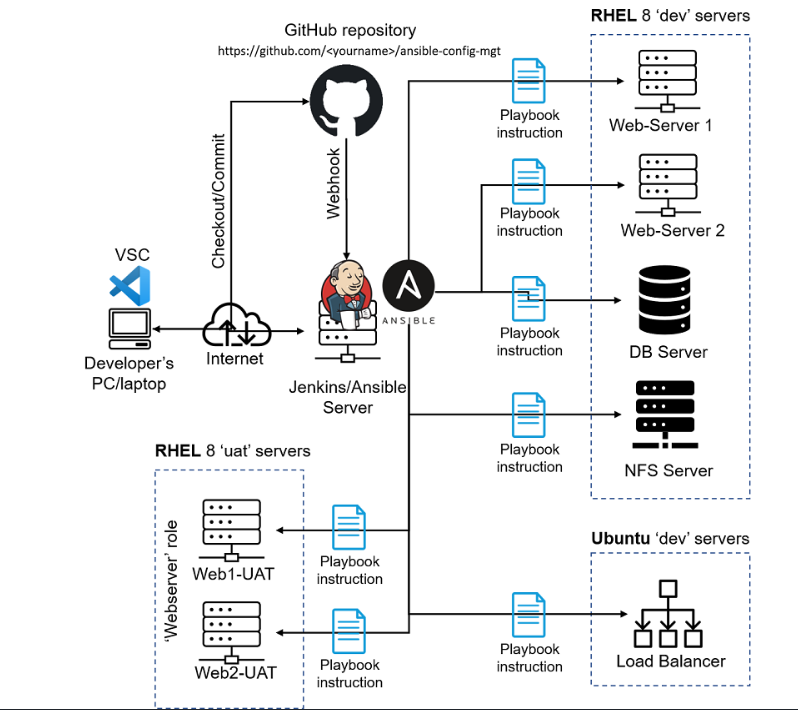
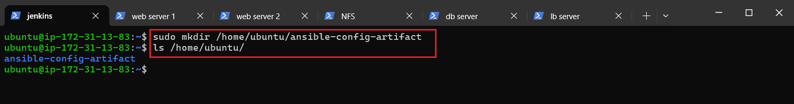
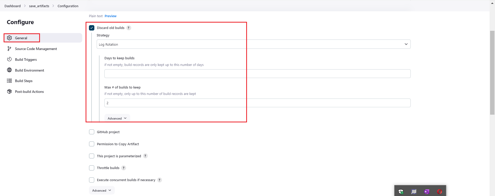

# ANSIBLE_REFACTORING_ASSIGNMENTS_-_IMPORTS
Ansible Refactoring and Static Assignments (IMPORTS AND ROLES)
In the previous project, I implemented CI/CD and Configuration Managment solution on the Development Servers using Ansible Ansible_Automate_Project.

In this project, I will be extending the functionality of this architecture and introducing configurations for UAT environment.


## STEP 1 - Jenkins Job Enhancement
at this stage every change to our jenkins job creates a separate directory which is not very convinient, and also consume space on the jenkins server. we will enhance this infrastructure by introducing a new jenkins project/job and we will require `copy-artifact` plugin.

we will begin by creating a new directory `ansible-config-artifact` as shown below 
we also need to change permission to the folder and directory by rinning the command `chmod -R 0777 <path-to-new-directory>

We then go on the connected jenkins web console ->Manage Jenkins -> plugins -> Available tab search for and install `copy artifact` plugin with out restarting Jenkins.


then create a new freestyle project `save_artifact and configure as follows 



then on the already webhooked `ansible` project this new project is configured to save the artifact of the `ansible` project in the newly created directory `/home/ubuntu/ansible-config-artifact` 
Test your set up by making some change in README.MD file inside our ansible-config-mgt repository (right inside master/main branch).

If both Jenkins jobs have completed one after another – you shall see our files inside /home/ubuntu/ansible-config-artifact directory and it will be updated with every commit to your master branch.

Now our Jenkins pipeline is more neat and clean.


## Step 2 – Refactor Ansible code by importing other playbooks into site.yml
In Project 11 , I wrote all tasks in a single playbook common.yml, now it is pretty simple set of instructions for only 2 types of OS, but imagine you have many more tasks and you need to apply this playbook to other servers with different requirements. In this case, you will have to read through the whole playbook to check if all tasks written there are applicable and is there anything that you need to add for certain server/OS families. Very fast it will become a tedious exercise and your playbook will become messy with many commented parts. Your DevOps colleagues will not appreciate such organization of your codes and it will be difficult for them to use your playbook.

In `playbooks folder`, create a new file and name it `site.yml` – This file will now be considered as an entry point into the entire infrastructure configuration.

Create a new folder in root of the repository and name it `static-assignments`. The static-assignments folder is where all other children playbooks will be stored

Move `common.yml` file into the newly created `static-assignments folder`.

Inside site.yml file, import common.yml playbook.


at this stage our structure looks like this 
```
{
├── static-assignments
│   └── common.yml
├── inventory
    └── dev
    └── stage
    └── uat
    └── prod
└── playbooks
    └── site.yml
}
```
Run ansible-playbook command against the `dev` environment
- create another playbook under static-assignments and name it `common-del.yml`. In this playbook, configure deletion of wireshark utility.
we then update `sit.yml` with `-import_playbook: ../static-assignments/common-del.yml` instead of `common.yml` and run it agains the `dev` servers
```
{
 ---
- name: update web, nfs and db servers
  hosts: webservers, nfs, db
  remote_user: ec2-user
  become: yes
  become_user: root
  tasks:
  - name: delete wireshark
    yum:
      name: wireshark
      state: removed

- name: update LB server
  hosts: lb
  remote_user: ubuntu
  become: yes
  become_user: root
  tasks:
  - name: delete wireshark
    apt:
      name: wireshark-qt
      state: absent
      autoremove: yes
      purge: yes
      autoclean: yes

}
```

we then `cd /home/ubuntu/ansible-config-artifact/` and run `ansible-playbook -i inventory/dev.yml playbooks/site.yml`


we then confirm that wireshark has been deleted 

## CONFIGURE UAT WEBSERVERS WITH A ROLE ‘WEBSERVER

## Step 3 – Configure UAT Webservers with a role ‘Webserver
we then launch 2 fresh EC2 instances using RHEL 8 image, we will use them as our uat servers, so give them names accordingly – Web1-UAT and Web2-UAT.


we then proceed to create roles by creating a new directory `roles` 
we can then create the required structure in 2 ways:
- by using ansible utility called `ansible-galaxy` inside `ansible-config-management/roles` directory i.e 
```
{
mkdir roles
cd roles
ansible-galaxy init webserver

}
```
removing unnecessary directories and files, the roles structure should look like this
```
{
└── webserver
    ├── README.md
    ├── defaults
    │   └── main.yml
    ├── handlers
    │   └── main.yml
    ├── meta
    │   └── main.yml
    ├── tasks
    │   └── main.yml
    └── templates
}
```
- by creating the directory and file structure manually


we then update your inventory `ansible-config-mgt/inventory/uat.yml` file with IP addresses of your 2 UAT Web servers
```
{
[uat-webservers]
<Web1-UAT-Server-Private-IP-Address> ansible_ssh_user='ec2-user' 

<Web2-UAT-Server-Private-IP-Address> ansible_ssh_user='ec2-user' 
}
```


we then proceed to confirm the presence of `ansible.cfg` in `/etc/ansible/ansible.cfg` or we create the file if it doent exist as shown below 

we then `cd` to the location of the `cfg` and open the file by running `sudo vi ansible.cfg` we then proceed to update the `roles_path` with the path to the roles. in this case `/home/ubuntu/ansible-config-artifact/roles/webserver` and save accordingly as shown below 

we then proceed to confirm that ansible has access to the correct roles path by running `echo $ANSIBLE_ROLES_PATH` and if the response is not the correct path we proceed to `export` the path by running `export ANSIBLE_ROLES_PATH=/home/ubuntu/ansible-config-artifact/roles/` i.e 
```
{
echo $ANSIBLE_ROLES_PATH

export ANSIBLE_ROLES_PATH=/path/to/your/roles/directory

}
```
as shown below 

at this stage we then proceed to add some logic to the webserver role. we go into `task` directory and within the `main.yml` we start writing configuration tasks to do the following:
-   Install and configure Apache (httpd service)
-   Clone Tooling website from GitHub https://github.com/<your-name>/tooling.git.
-   Ensure the tooling website code is deployed to /var/www/html on each of 2 UAT Web servers.
-   Make sure httpd service is started

this is don by adding the folloing to the `main.yml` file 
```
{
---
- name: install apache
  become: true
  ansible.builtin.yum:
    name: "httpd"
    state: present

- name: install git
  become: true
  ansible.builtin.yum:
    name: "git"
    state: present

- name: clone a repo
  become: true
  ansible.builtin.git:
    repo: https://github.com/<your-name>/tooling.git
    dest: /var/www/html
    force: yes

- name: copy html content to one level up
  become: true
  command: cp -r /var/www/html/html/ /var/www/

- name: Start service httpd, if not started
  become: true
  ansible.builtin.service:
    name: httpd
    state: started

- name: recursively remove /var/www/html/html/ directory
  become: true
  ansible.builtin.file:
    path: /var/www/html/html
    state: absent
}
```

## REFERENCE WEBSERVER ROLE
## Step 4 – Reference ‘Webserver’ role
In the `static-assignments` folder, we create a new assignment for uat-webservers `uat-webservers.yml`.
Then we reference the role
```
{
---
- hosts: uat-webservers
  roles:
     - webserver
}
```


Since the entry point to our ansible configuration is the site.yml file. Therefore, you need to refer your uat-webservers.yml role inside site.yml.

So, we should have this in site.yml
```
{
---
- hosts: all
- import_playbook: ../static-assignments/common.yml

- hosts: uat-webservers
- import_playbook: ../static-assignments/uat-webservers.yml
}
```

## Step 5 - Commit and Test
we then commit our changes to the Git repo and since we have webhooked the repo to our jenkins web platform and also  saving artifacts concurrently all our changes will be saved in `/home/ubuntu/ansible-config-artifact`
Also before running the playbook we must ensure that we have tunneled into `Jenkins-Ansible` server via ssh agent this is done by 
```
{
eval "$(ssh-agent -s)"
ssh-add /path/to/your/private_key
ssh-add -l
ssh username@your_server_ip
}
```
we then `cd` to `ansible-config-artifact` and then run the ansible playbook command `ansible-playbook -i inventory/uat.yml playbooks/site.yml` as shown below 


at this stage our machine runs the commands prescribed in `task/main.yml` file and our architecture now looks like this 

### Code containing all configuration can be found in https://github.com/Divinepj/ansible-config-management.git


